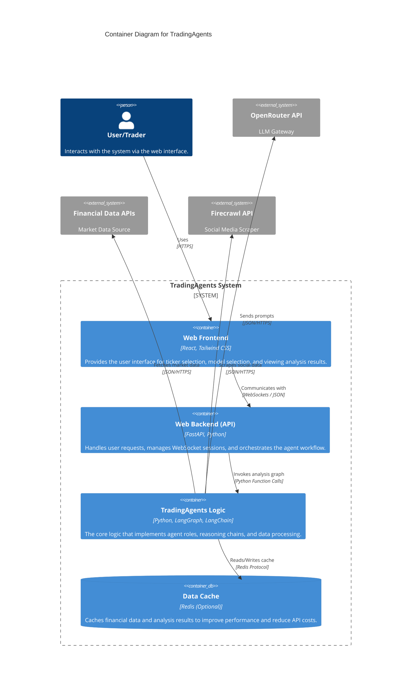

# Container Diagram - TradingAgents

## Containers
- **Web Frontend**: A modern React application that displays real-time agent reasoning and final trading recommendations.
- **Web Backend**: A FastAPI server that provides a bridge between the frontend and the complex AI logic. It uses WebSockets to stream live updates from the agents.
- **TradingAgents Logic**: The "brain" of the system. It uses LangGraph to orchestrate a multi-step debate and analysis process between specialized agents.
- **Data Cache**: A Redis-based caching layer to store frequently accessed market data and news.
