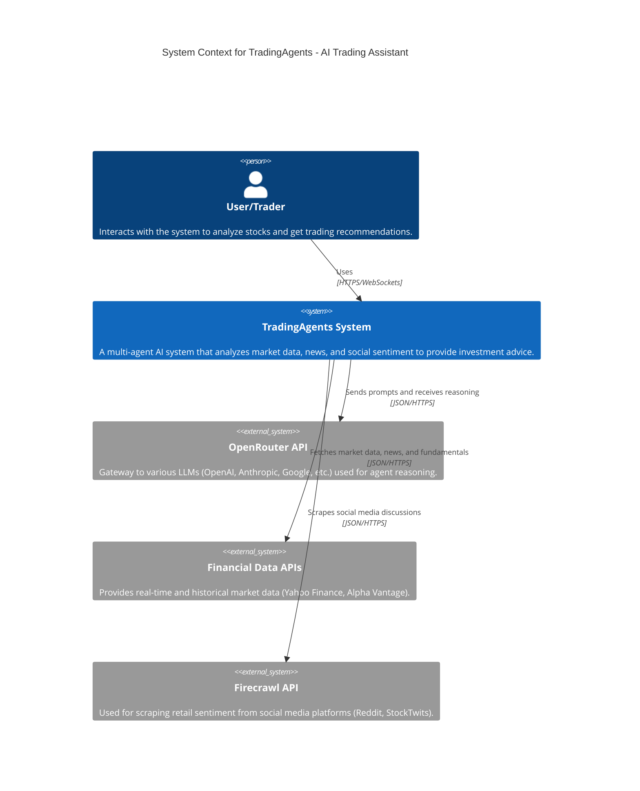

# System Context - TradingAgents

## Description
TradingAgents is an advanced multi-agent system designed to assist traders by aggregating and analyzing vast amounts of financial and social data. It leverages Large Language Models (LLMs) via OpenRouter to simulate a professional trading team, including analysts, researchers, and risk managers.
