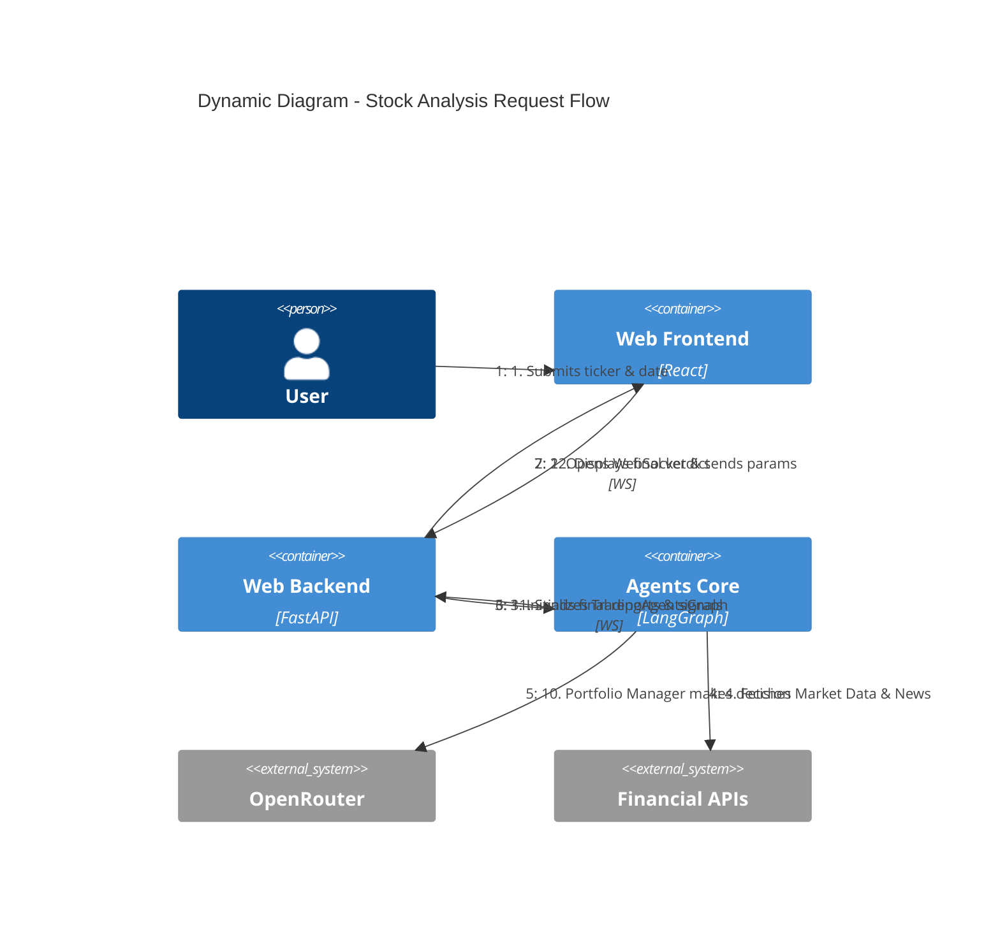

# Dynamic Diagram - Stock Analysis Flow

## Workflow Description
1. **Initiation**: The user selects a stock symbol and target date.
2. **Streaming**: As agents work, their thoughts and intermediate reports are streamed back to the frontend in real-time.
3. **Multi-Agent Chain**:
    - **Analysts**: Gather and interpret raw data (Financials, Social, News).
    - **Researchers**: Debate bullish and bearish cases.
    - **Risk Mgmt**: Analyzes the proposed strategy for potential downsides.
    - **Portfolio Manager**: Synthesizes all inputs into a final BUY/HOLD/SELL recommendation.
